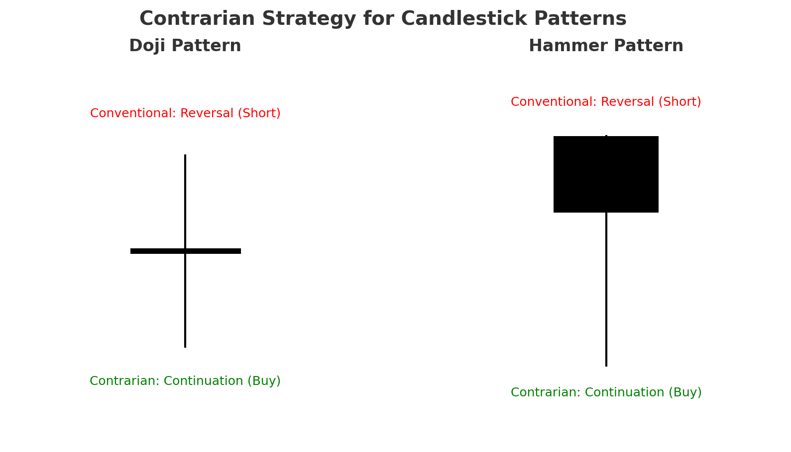
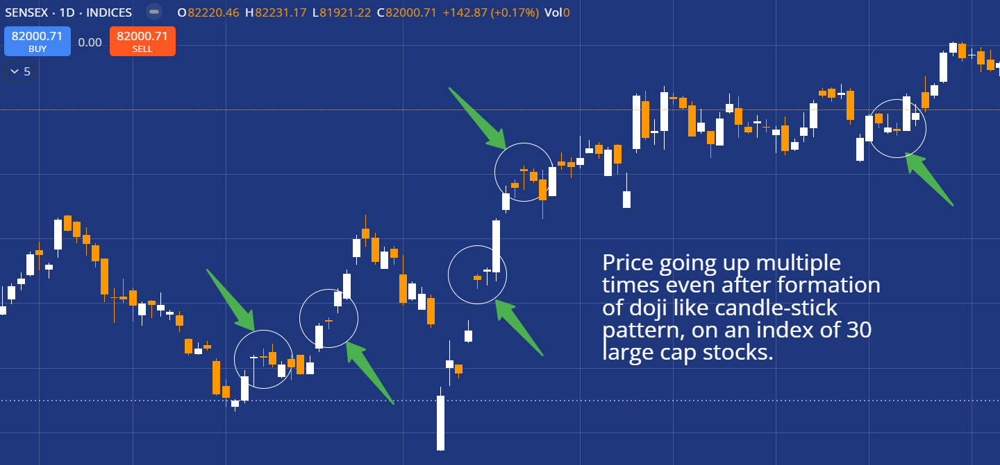

# Time-Series Forecasting for India's NIFTY Index Using a Behavioral Contrarian Candlestick Framework
### Integrating Investor Psychology and Behavioral Biases into Quantitative Time-Series Models

---

## What This Project Is About

Stock markets are not governed solely by rational expectations or fundamental valuations. Instead, they are heavily influenced by investor psychology and collective behavioral biases. Retail investors, in particular, often rely on widely circulated technical charting methods, especially candlestick pattern analysis, to guide their trading decisions. While these visual patterns are simple to interpret and readily available across textbooks, brokerage platforms, and financial media, their very popularity creates predictable crowd behavior.

The Securities and Exchange Board of India (SEBI) reported in 2024 that 93% of individual traders in equity Futures & Options incurred losses between FY22–FY24, with cumulative losses exceeding 1.8 lakh crore INR. This statistic underscores that the vast majority of retail traders, despite having access to candlestick literature and mainstream technical guidance, consistently lose money. One plausible explanation is that when most market participants act on the same predictable signals, the market tends to move against the majority. In such cases, a contrarian approach, deliberately acting opposite to the standard interpretation, can produce higher success rates by exploiting behavioral inefficiencies.

> *Figure 1: Conventional vs. Contrarian interpretation of the Doji and Hammer candlestick patterns.*
 

  

To illustrate, consider the Doji candlestick pattern, which traditionally signifies market indecision and a potential reversal. If an upward trend culminates in a Doji, conventional candlestick interpretation suggests that bullish momentum is weakening and that traders should prepare for a downward reversal (i.e., initiate a short position). However, empirical observation suggests that markets frequently continue upward despite the Doji, precisely because a large segment of retail traders anticipates a reversal and positions themselves accordingly. By taking the inverse action (buying instead of shorting), one can potentially capitalize on the crowd's consistent misjudgment.

> *Figure 2: SENSEX daily chart illustrating multiple instances where price continued upward 
> following Doji-like candlestick formations on an index of 30 large-cap stocks.*
 

  

This project leverages such insights by integrating a contrarian psychological variable into time-series forecasting models. While not every candlestick misinterpretation leads to the opposite outcome, statistical evidence suggests that acting against widely followed retail strategies yields a better-than-random edge. This introduces a unique blend of behavioral finance and time-series modeling, transforming a purely quantitative forecast into one that accounts for real-world trading psychology.
